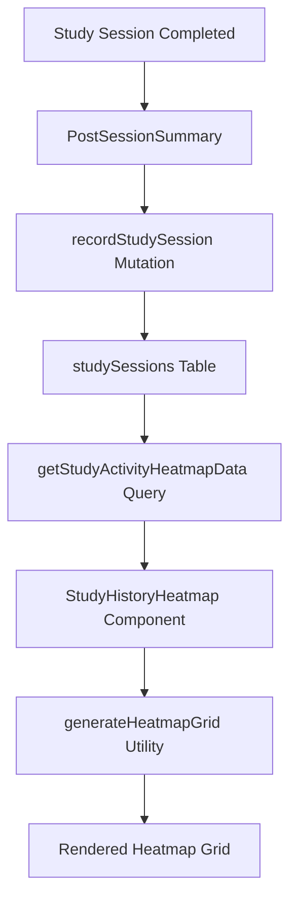

# Study History Heatmap Implementation

## Overview

The Study History Heatmap provides a GitHub-style contribution graph visualization of user study activity over the last 365 days. This component offers users a comprehensive view of their learning consistency and patterns, encouraging regular study habits through visual feedback.

## Features

### 📊 **Visual Design**
- **GitHub-Style Grid**: 365-day contribution graph with weekly columns
- **Activity Levels**: 5-level color intensity system (0-4) based on cards studied
- **Dark Theme**: Consistent with app styling using cohesive blue activity indicators
- **Month Labels**: Positioned above grid columns for easy date reference
- **Day Labels**: Vertical labels (M, T, W, T, F, S, S) on the left side
- **Responsive Design**: Horizontal scrolling on mobile, full grid on desktop

### 🎯 **Interactive Features**
- **Hover Tooltips**: Detailed information on mouse hover
- **Keyboard Navigation**: Full accessibility with Tab/Enter/Space support
- **Activity Legend**: Color scale indicator with "Less" to "More" labels
- **Summary Statistics**: Key metrics displayed below the grid

### 📈 **Data Integration**
- **Real-time Data**: Fetches from Convex study sessions database
- **Daily Aggregation**: Combines multiple sessions per day per deck
- **365-Day Range**: Automatically calculates rolling year window
- **Performance Optimized**: Efficient database queries with proper indexing

## Technical Implementation

### Database Schema

The heatmap relies on the `studySessions` table:

```typescript
studySessions: defineTable({
  userId: v.string(),           // ID of the user who completed this session
  deckId: v.id("decks"),       // Reference to the deck studied
  sessionDate: v.string(),     // Date in YYYY-MM-DD format (user's local date) for consistent daily aggregation
  cardsStudied: v.number(),    // Number of cards reviewed in this session
  sessionDuration: v.optional(v.number()), // Duration in milliseconds
  studyMode: v.union(v.literal("basic"), v.literal("spaced-repetition")), // Type of study session
  // Timezone-aware fields for accurate date handling
  utcTimestamp: v.optional(v.string()),    // ISO 8601 UTC timestamp for canonical reference
  userTimeZone: v.optional(v.string()),    // IANA timezone identifier (e.g., "America/New_York")
}).index("by_userId_and_date", ["userId", "sessionDate"])     // Index for efficient user activity queries
  .index("by_userId_and_deckId", ["userId", "deckId"])        // Index for deck-specific activity
  .index("by_date", ["sessionDate"])                          // Index for date-based queries
  // Compound index to efficiently check for existing sessions and prevent duplicates
  .index("by_unique_session", ["userId", "sessionDate", "deckId", "studyMode"]),
```

### Component Structure

#### File Location
```
src/components/StudyHistoryHeatmap.tsx
```

#### Key Dependencies
- **Convex Integration**: `useQuery` for real-time data fetching
- **Utility Functions**: `src/lib/heatmapUtils.ts` for grid generation and calculations
- **Skeleton Loading**: `HeatmapSkeleton` for loading states
- **TypeScript**: Full type safety with custom interfaces

### Activity Level System

The heatmap uses a 5-level activity system based on cards studied per day:

```typescript
export function getActivityLevel(cardsStudied: number): 0 | 1 | 2 | 3 | 4 {
  if (cardsStudied === 0) return 0;      // No activity - dark gray
  if (cardsStudied <= 2) return 1;       // Low activity - light green
  if (cardsStudied <= 10) return 2;      // Moderate activity - medium green
  if (cardsStudied <= 20) return 3;      // High activity - bright green
  return 4;                              // Very high activity - brightest green
}
```

### Grid Generation Algorithm

The heatmap grid is generated using a sophisticated algorithm that:

1. **Creates 365-day range** from current date backwards
2. **Organizes days into weeks** starting with Sunday
3. **Handles month boundaries** and generates month labels
4. **Fills empty days** for proper grid alignment
5. **Maps study data** to corresponding grid positions
6. **Calculates activity levels** for color coding

### Data Flow



## Integration Points

### Study Session Recording

Study sessions are automatically recorded when users complete study sessions:

```typescript
// In PostSessionSummary.tsx
const recordStudySession = useMutation(api.studySessions.recordStudySession);

useEffect(() => {
  if (!hasRecordedSession && cardsReviewed > 0) {
    // Get user's timezone and local date for accurate session recording
    const userTimeZone = getUserTimeZone();
    const localDate = getLocalDateString(userTimeZone);

    recordStudySession({
      deckId,
      cardsStudied: cardsReviewed,
      sessionDuration,
      studyMode,
      userTimeZone,
      localDate,
    });
    setHasRecordedSession(true);
  }
}, [deckId, cardsReviewed, sessionDuration, studyMode, recordStudySession, hasRecordedSession]);
```

### Statistics Dashboard Integration

The heatmap is prominently displayed in the Statistics Dashboard:

```typescript
// In StatisticsDashboard.tsx
<div className="mb-8">
  <StudyHistoryHeatmap />
</div>
```

## Accessibility Features

### ARIA Support
- **Role Attributes**: `gridcell` for heatmap squares
- **ARIA Labels**: Descriptive labels for each day square
- **Status Indicators**: Loading states with proper `aria-busy` attributes

### Keyboard Navigation
- **Tab Navigation**: All interactive elements are keyboard accessible
- **Enter/Space Keys**: Activate tooltips on focused squares
- **Focus Management**: Proper focus indicators and management

### Screen Reader Support
- **Semantic HTML**: Proper heading hierarchy and structure
- **Alternative Text**: Meaningful descriptions for visual elements
- **Status Updates**: Loading and error states announced to screen readers

## Performance Optimizations

### Database Efficiency
- **Compound Indexes**: Optimized queries with `by_userId_and_date` index
- **Date Range Filtering**: Server-side filtering to minimize data transfer
- **Aggregation Logic**: Efficient daily aggregation in database queries

### Frontend Optimization
- **Memoization**: Component wrapped with `React.memo`
- **Efficient Rendering**: Minimal re-renders with proper dependency arrays
- **Skeleton Loading**: Immediate visual feedback during data loading

### Memory Management
- **Event Cleanup**: Proper event listener cleanup
- **State Management**: Minimal state with efficient updates
- **Tooltip Optimization**: Single tooltip element with position updates

## Testing Strategy

### Unit Tests
- **Component Rendering**: Tests for all visual states and interactions
- **Utility Functions**: Comprehensive tests for grid generation and calculations
- **Data Handling**: Tests for empty data, edge cases, and error states
- **Accessibility**: Tests for keyboard navigation and ARIA attributes

### Integration Tests
- **Database Integration**: Tests for Convex query integration
- **User Interactions**: Tests for hover, click, and keyboard interactions
- **Loading States**: Tests for skeleton loading and error handling

## Usage Examples

### Basic Usage
```typescript
import StudyHistoryHeatmap from './components/StudyHistoryHeatmap';

function MyDashboard() {
  return (
    <div>
      <h1>My Learning Dashboard</h1>
      <StudyHistoryHeatmap />
    </div>
  );
}
```

### Custom Styling
The component uses Tailwind CSS classes and can be customized through CSS variables or by extending the existing classes.

## Future Enhancements

### Potential Features
- **Date Range Selection**: Allow users to view different time periods
- **Deck Filtering**: Filter heatmap by specific decks
- **Export Functionality**: Export heatmap data as image or CSV
- **Goal Setting**: Visual indicators for daily/weekly study goals
- **Streak Highlighting**: Visual emphasis on study streaks

### Performance Improvements
- **Virtual Scrolling**: For very large date ranges
- **Data Caching**: Client-side caching for frequently accessed data
- **Progressive Loading**: Load data in chunks for better perceived performance

## Troubleshooting

### Common Issues
1. **Empty Heatmap**: Ensure study sessions are being recorded properly
2. **Loading Issues**: Check Convex connection and authentication
3. **Date Misalignment**: Verify timezone handling in date calculations
4. **Performance Issues**: Check database indexes and query efficiency

### Debug Tools
- **Browser DevTools**: Inspect component state and props
- **Convex Dashboard**: Monitor database queries and performance
- **Console Logging**: Built-in error handling and logging
